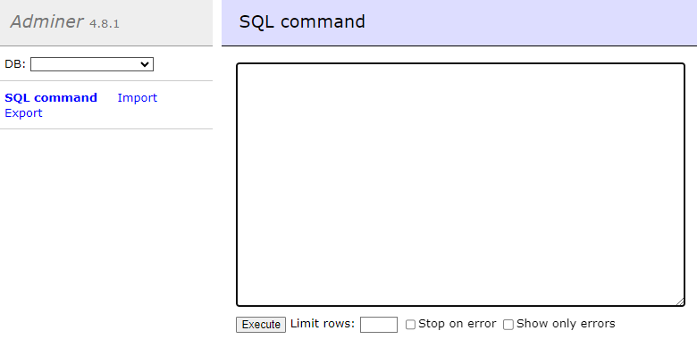
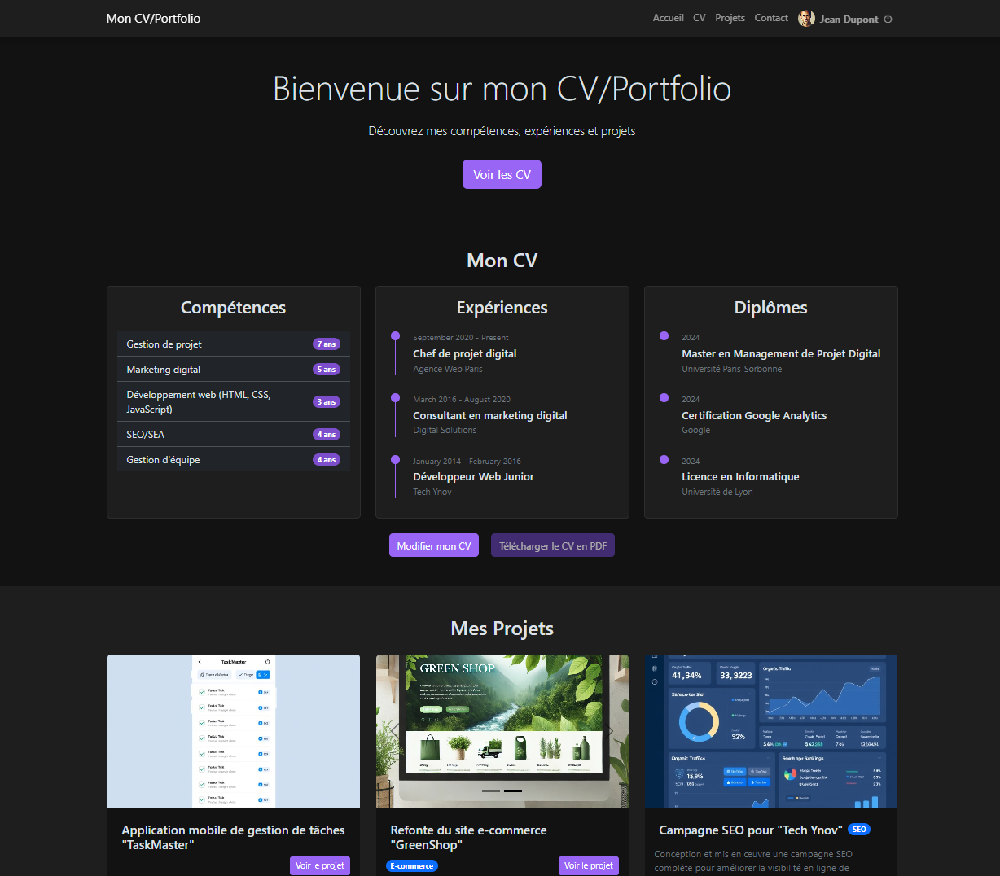
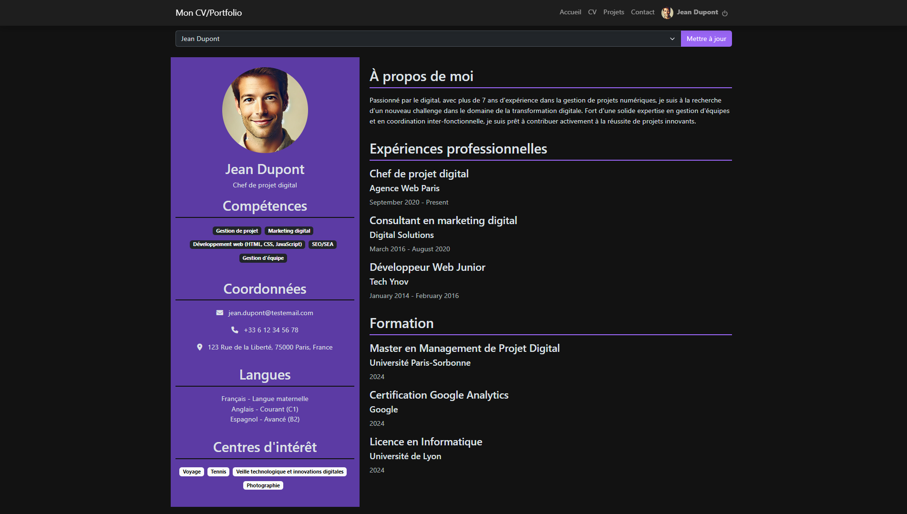
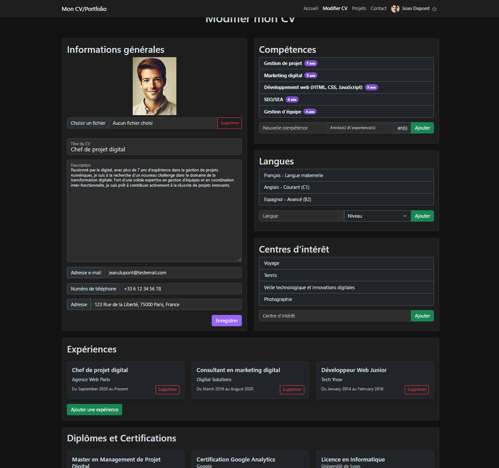
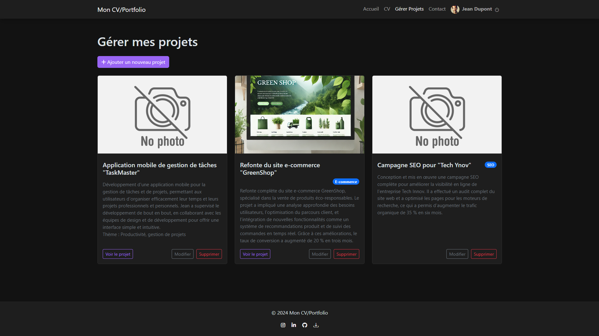

 

# CV/Portfolio Project in PHP

## Description
This project is a CV/Portfolio website in PHP. Its objective is to allow users to create and manage their own CV and portfolio, with administration, personalization and user management functionalities. The project follows PHP development best practices and uses a database to store and persist information.
## Technologies

- **Server :** Docker, Nginx
- **Client :** PHP
- **Data Base :** MySql

##  Dependencies

- PHP 8.0 or higher 
- Docker
- Bootstrap
## Features

- User creation and connection
- CV management
- Project management
- Manage your profile


## Installation

Clone project on Git

```bash
  git clone https://github.com/erwnn20/PHP-TP.git
  cd PHP-TP/
```

## Deployment

To deploy this project run

```bash
  cd Docker/
  docker-compose up
```

Then, open a browser and go to ```127.0.0.1```

### Setup

Before you can start browsing the site, you need to initialize the database.
To do this, go to ```127.0.0.1:8080```, log in and execute the requests of ```setup/db.sql file``` there :


Also check that all ```.php``` files are encoded in ```UTF-8 without BOM```.

Once you've done all this, you're ready to go.
# Welcome to our CV creation website

### Home Page


### Resume Page


### CV creation Page


### Project creation Page



## Authors

- Erwann Varlet - [@erwnn_](https://www.github.com/erwnn20)

